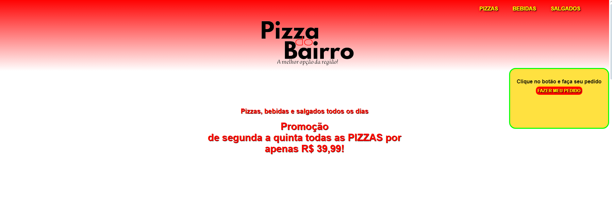
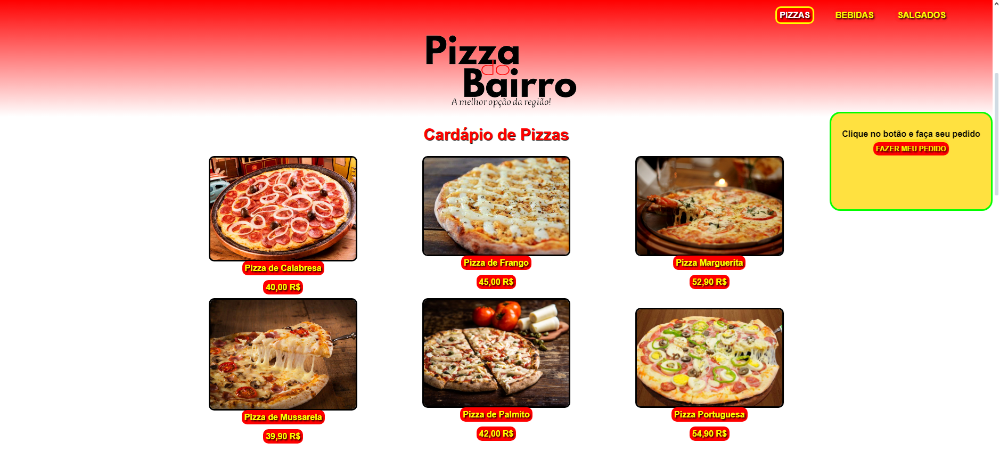
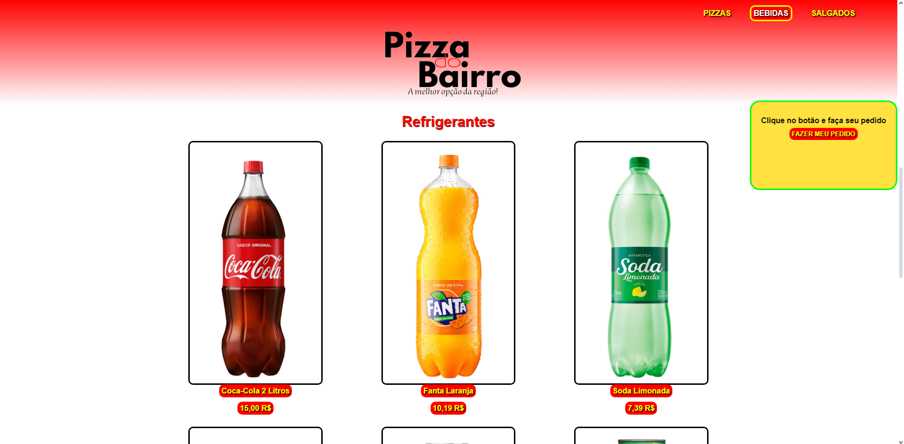
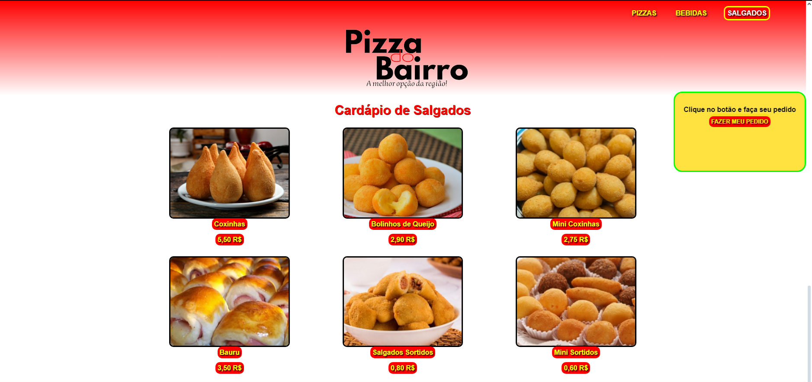

<h1 align="center">Projeto Pizzaria</h1>

  <a href="#-tecnologias">Tecnologias</a>&nbsp;&nbsp;&nbsp;|&nbsp;&nbsp;&nbsp;
  <a href="#-projeto">Projeto</a>&nbsp;&nbsp;&nbsp;|&nbsp;&nbsp;&nbsp;

 

  

## Tecnologias

Esse projeto foi desenvolvido com as seguintes tecnologias:

- HTML e CSS
- Git e Github

## Projeto

Esse site consiste apresentar um site fast food básico de uma pizzaria, contendo apenas o frontend.

  

 

  

 

  

 

  

